# Bootcamp_Projects

## Data Technician Portfolio | Just IT Bootcamp
  Welcome to my professional portfolio! My name is Ramona Petre, and this repository serves as a comprehensive showcase of the technical skills and projects I developed during the intensive 8-week Data Technician Bootcamp at Just IT.

### 🛠 Technical Skills
  Throughout this program, I have gained hands-on experience and proficiency in the following technologies:
  * Data Analysis & Manipulation: Excel (Advanced), SQL
  * Data Visualization: Power BI, Tableau
  * Programming: Python
  * Cloud Platforms: Microsoft Azure / Google Cloud

### 📌 Overview
This repository documents my journey through data analysis, technical troubleshooting, and data management. It is structured to provide a clear view of my progression and mastery of the curriculum.

### 📂 Repository Structure
  To ensure easy navigation, the project is divided into two main sections:
  * [Workbooks](Workbooks): This directory contains all completed and graded workbooks. Each file reflects hands-on application of data technician principles.
  * [Workbook Images](Workbook-images): A curated collection of screenshots highlighting key milestones, data visualizations, and relevant technical outputs from each module.

### ⚙️ Key Features
  * Professional Naming Convention: All files are systematically named for quick reference and ease of analysis.
  * Graded Excellence: The workbooks included have been reviewed and graded, meeting the high standards of the Just IT program.
  * End-to-End Documentation: From raw data handling to final reporting.

### 🖼️ Weekly workbooks with images

<ins>**1. Week 1 - Excel Fundamentals**</ins>
In this initial phase of my journey, we focused on the foundational pillars of a Data Technician role: legal compliance and core data manipulation. We explored the critical frameworks that govern our industry, including the UK Data Protection Act (DPA), GDPR, and the Computer Misuse Act. Understanding the ethical and legal implications of data handling, such as the 'right to be forgotten' and the consequences of data breaches, has shaped my approach to data privacy.

On the technical side, we went further in Microsoft Excel. I worked with retail sales datasets to perform data cleaning, complex sorting, and statistical analysis using functions like SUM, AVERAGE, and SWITCH. We also mastered Pivot Tables to transform raw data into actionable insights, providing a solid base for advanced analytics.

  Excel Data Cleaning showcasing the Best and Worst Exam Scores from a Dataset

  Showcasing a completed Pivot table created from a dataset.
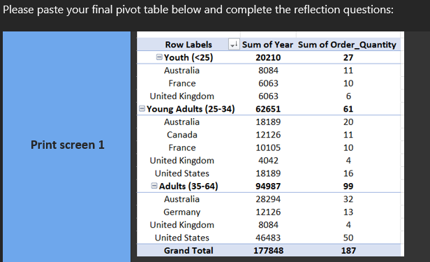

  Creating visual dashboards using the Pivot table created previously.
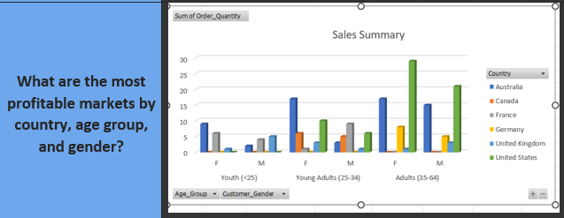

  More visuals from the same Pivot table, now showing line chart, column chart, and a pie chart.
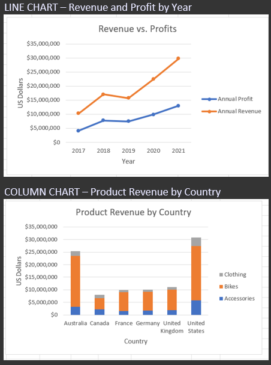
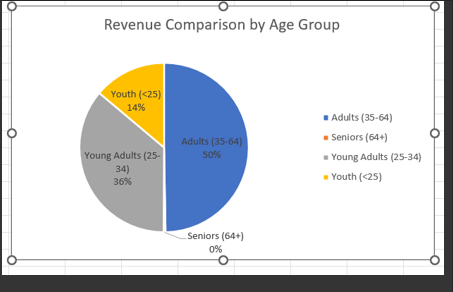

<ins>**2. Week 2 - Data Visualization with Tableau and PowerBI**</ins>
Transitioning into the visual layer of data, we explored the industry-leading BI tools: Tableau and Power BI. We conducted a comparative analysis of Tableau versions (Public vs. Desktop/Server), understanding the trade-offs between cost, privacy, and data connectivity.

By far my favourite week of studying, I put these tools into practice by building interactive dashboards. One highlight was using the EMSI Job Change UK dataset to create a map-based visualization of city-level employment shifts. I also completed advanced labs in Power BI, focusing on report design and dashboard creation, which taught me how to tell a compelling story with data that is both visually engaging and technically robust.

Showcasing the usage of Tableau to create dashboards based on trends. Top screenshot is showing the city-level employment trends in the UK, then the remaining ones show life expectancy and cancer rates across the world.

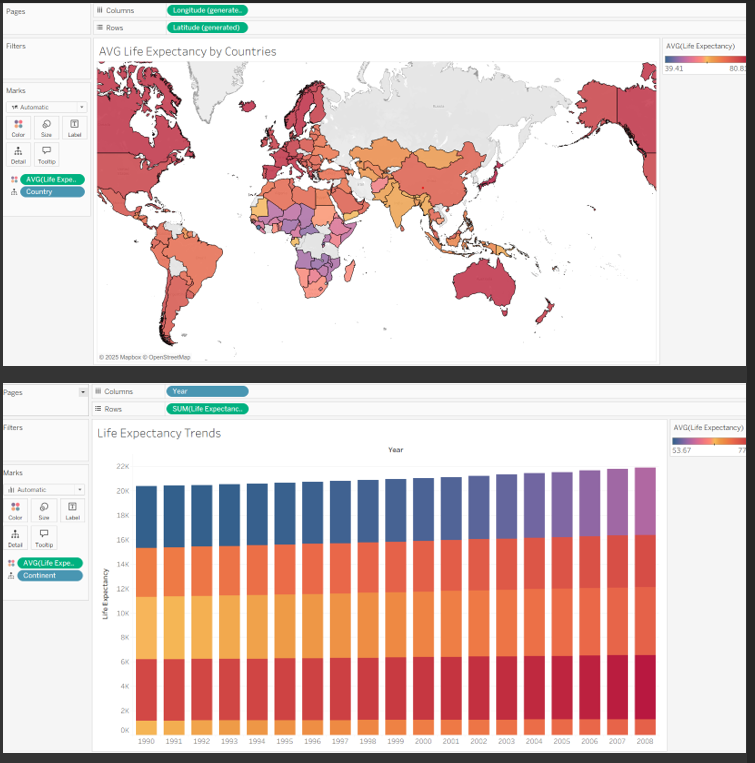
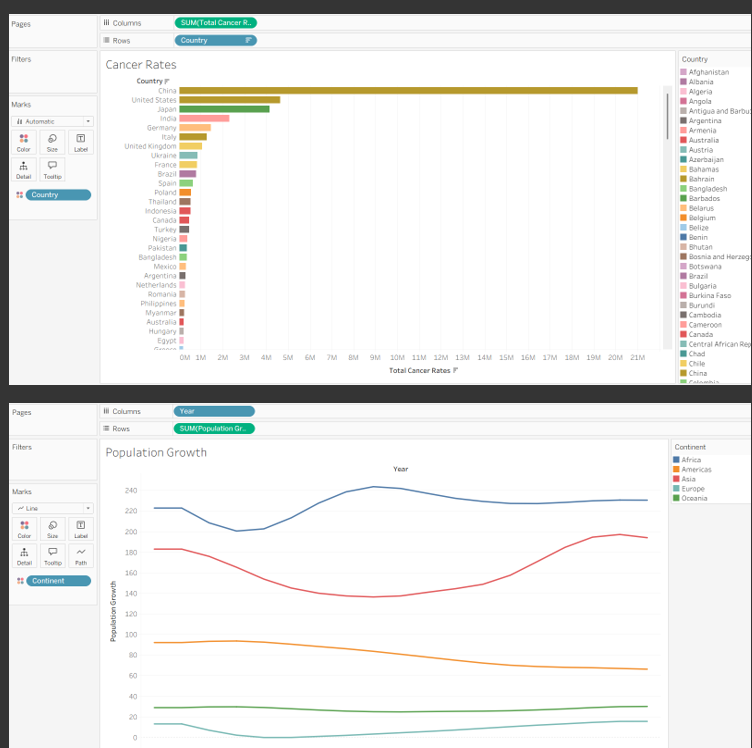

Multiple Power BI labs completed on a virtual machine using Microsoft Learn. Labs consisted of data manipulation and visualization.
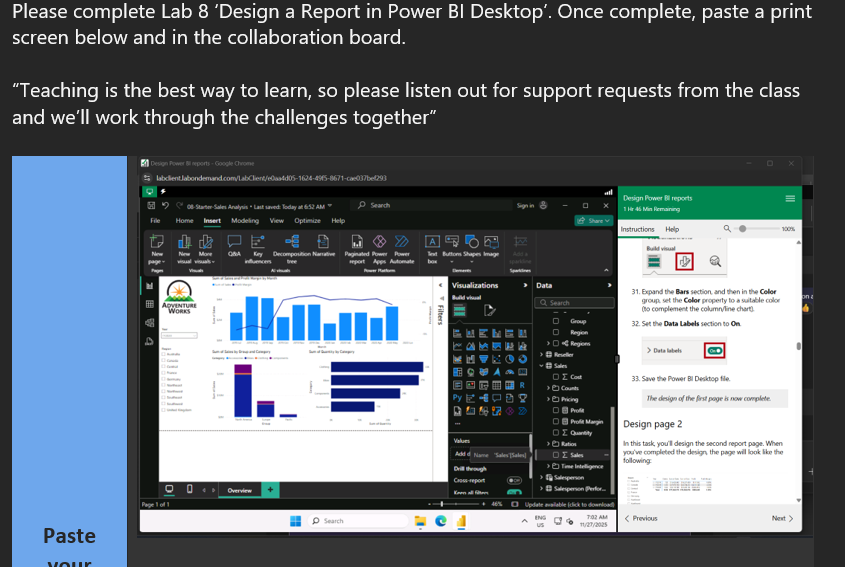
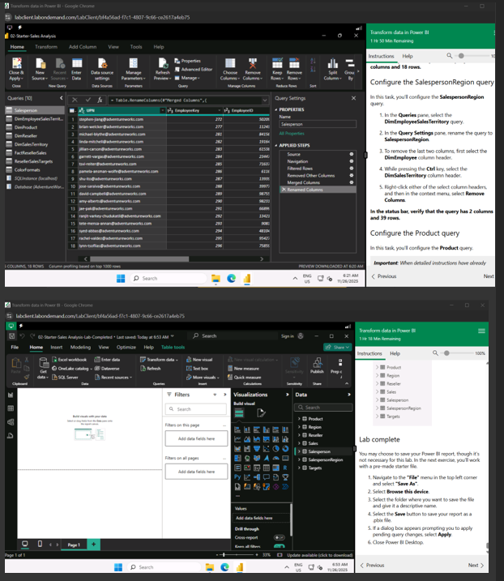
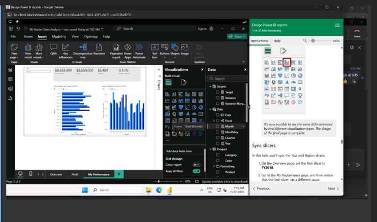

<ins>**3. Week 3 - SQL**</ins>
In this module, we dived deep into Database Management Systems (DBMS). We mastered the concepts of Relational vs. Non-Relational databases, learning when to prioritize the structured consistency of SQL over the flexible scalability of NoSQL.

I spent significant time writing SQL queries to extract insights from complex databases. I practiced various JOIN types (Inner, Left, Right, Full, and Self-joins) to connect disparate data tables. My practical work included real-world scenarios like identifying urban demographics, analyzing GDP per capita, and filtering agricultural data based on population density.

Images showcase profound understanding of important JOIN queries in SQL.

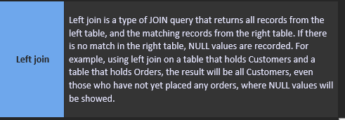

Creating a database for an imaginary shop, containing tables of Products and Suppliers.
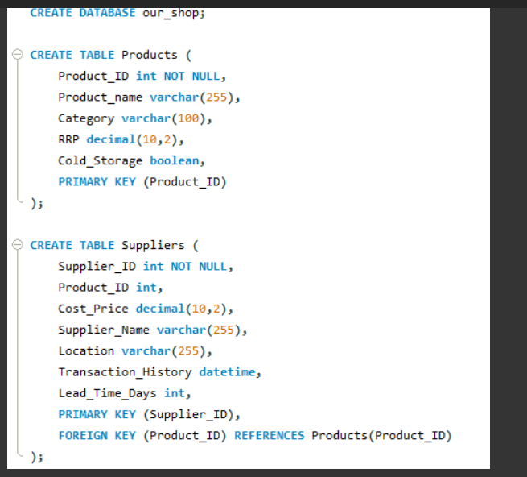

All three images showcase working on a given dataset using SQL queries, such as ORDER BY.
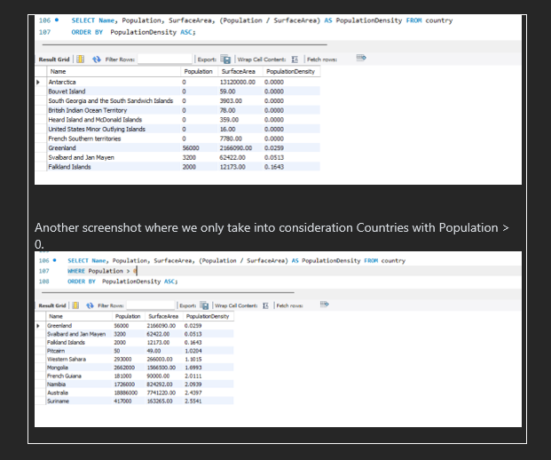
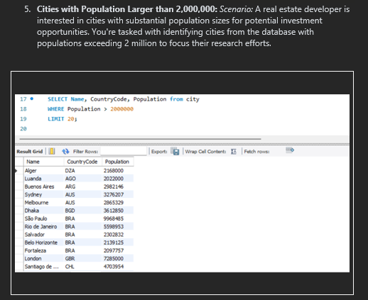
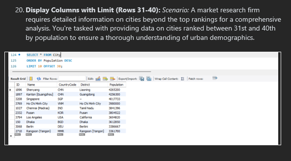

<ins>**4. Week 5 - Cloud computing and Azure**</ins>
As businesses move to the cloud, we specialized in Cloud Infrastructure, specifically within the Microsoft Azure ecosystem. I researched the core service models, IaaS, PaaS, and SaaS, and evaluated how global providers like AWS, Azure, and GCP differ in their offerings.

 Showing true understanding of the Cloud infrastructure and providers, such as Microsoft Azure, Amazon Web Services, and Google Cloud Platform.
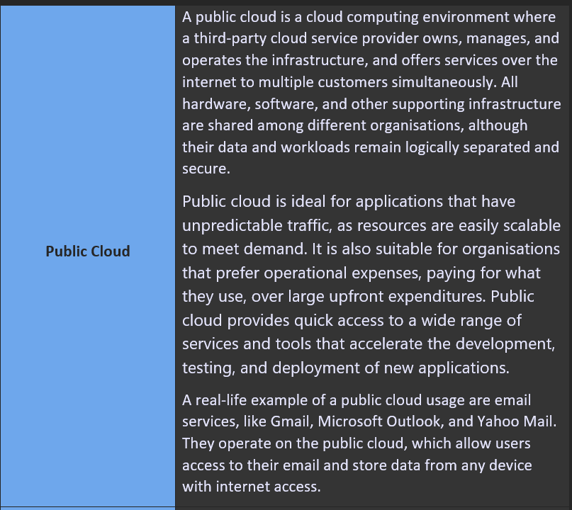
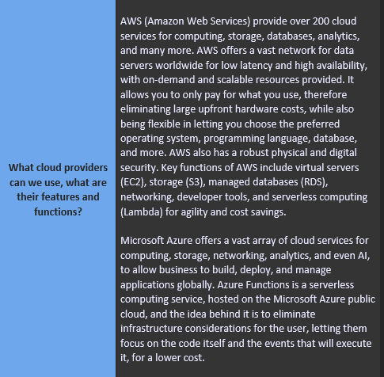
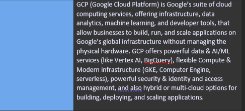

Showing understanding of service models, like IaaS, PaaS, and SaaS.
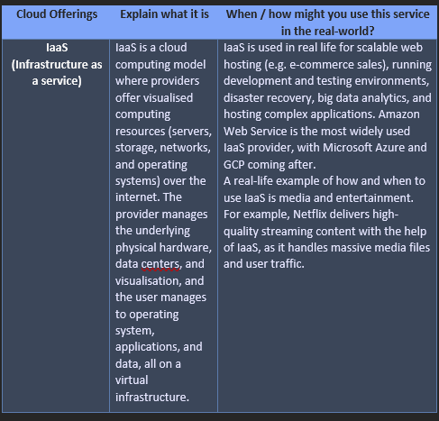
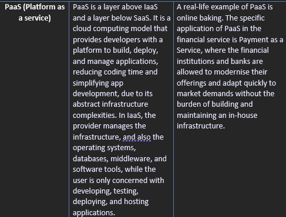
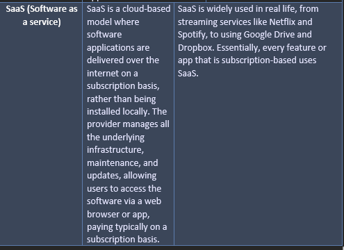

	
The highlight of this module was a comprehensive case study for 'Paws & Whiskers,' where I designed a cloud migration strategy. I recommended specific Azure services like Azure Functions for serverless computing and Azure Data Factory for automating data pipelines. This project demonstrated my ability to align cloud technology with business goals like scalability, security, and cost-efficiency.
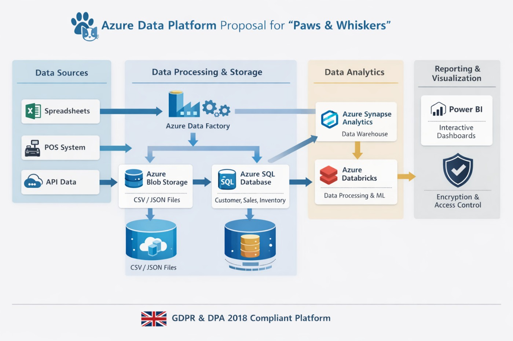

<ins>**5. Week 6 - Python**</ins>
The final piece of my toolkit is Python, the industry standard for data science. I began with logical problem-solving, such as the classic FizzBuzz algorithm, to sharpen my coding syntax.
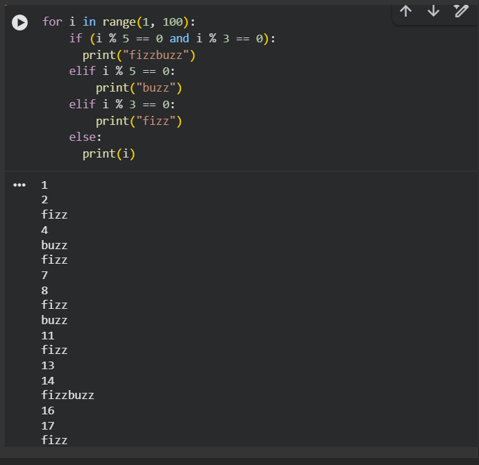
  *Caption: For all numbers that are divisible by 3, show 'fizz', all numbers divisble by 5, show 'buzz', and numbers divisible by both, show 'fizzbuzz'. Show the number otherwise.*

  I then moved into heavy-duty data manipulation using the Pandas library. I practiced loading large CSV datasets, performing data cleaning, slicing, and advanced aggregations. I also explored data visualization within Python to identify trends in global GDP and demographics. This module solidified my ability to automate data tasks and perform deep exploratory data analysis (EDA).

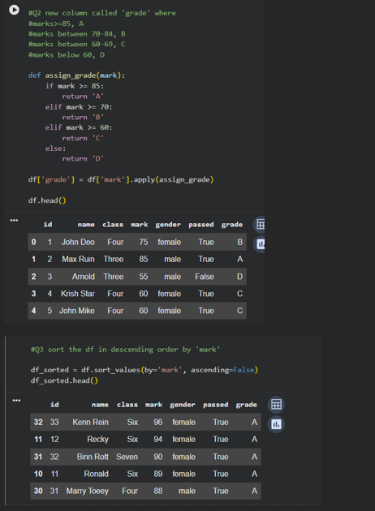
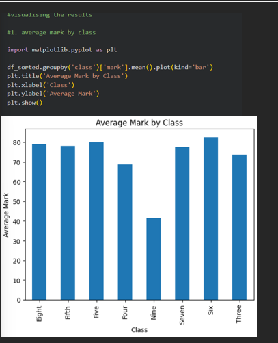
  *Caption: Data manipulation in Python using the Pandas library and functions such as apply() and head(). Also showing understanding of the matplotlib library and showing data visualization using it in Python.*
  
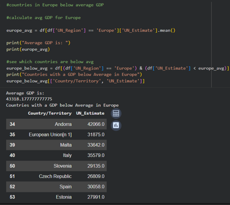
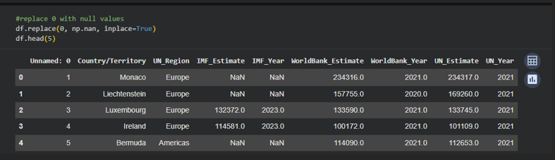

  *Caption: Further data manipulation on a given dataset with countries and their respective IMF, UN, and WorldBank GDP Estimates.*

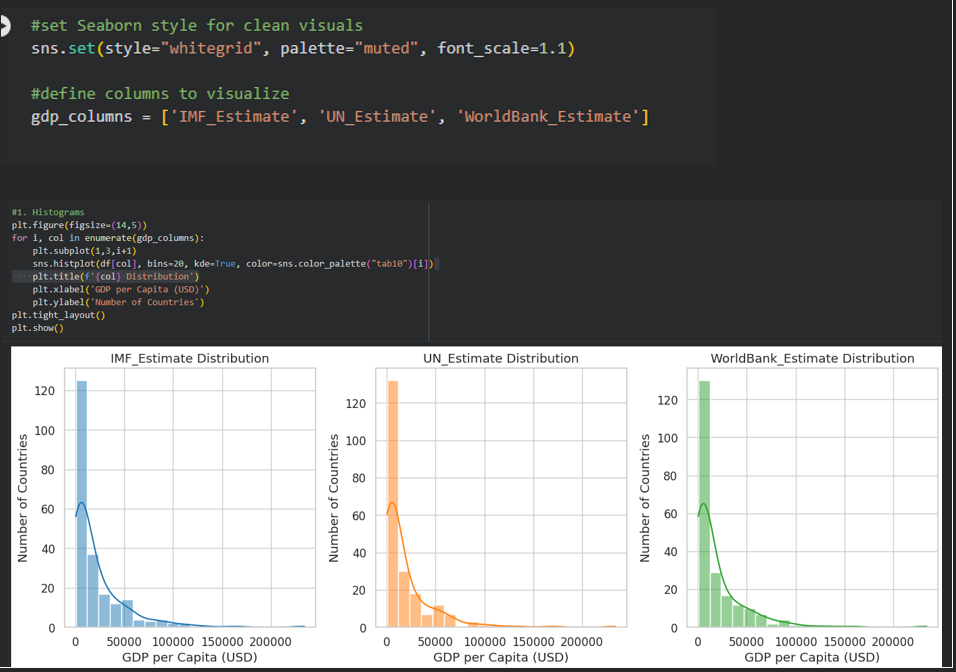
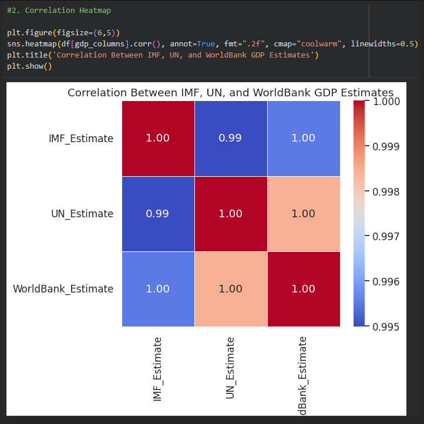
  *Caption: Using matplotlib library to create visual dashboards of the same dataset above.*

  
Thank you for visiting my repository! Feel free to explore the folders above to see my work in detail.
